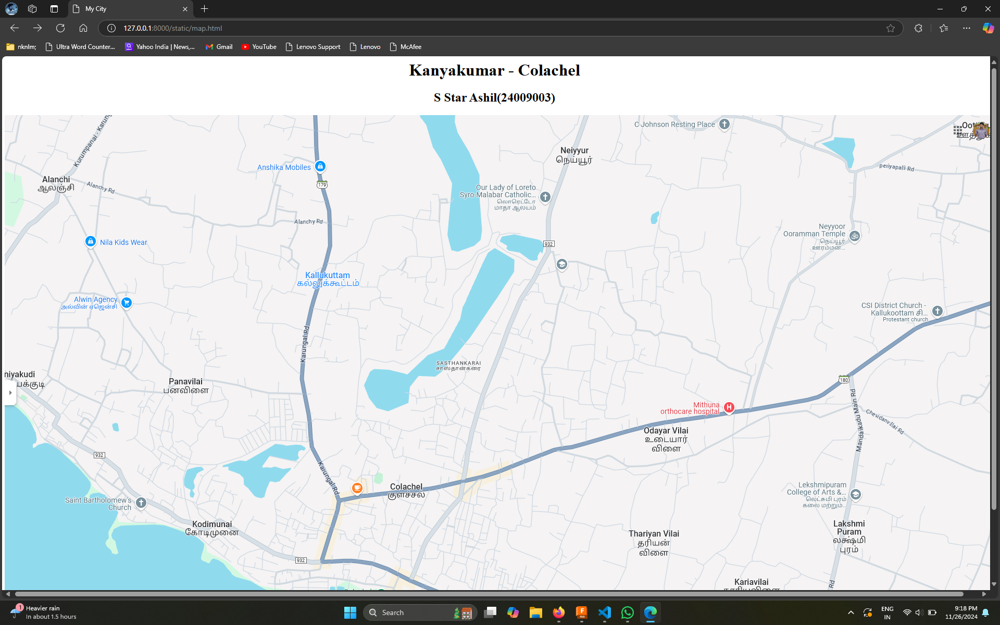
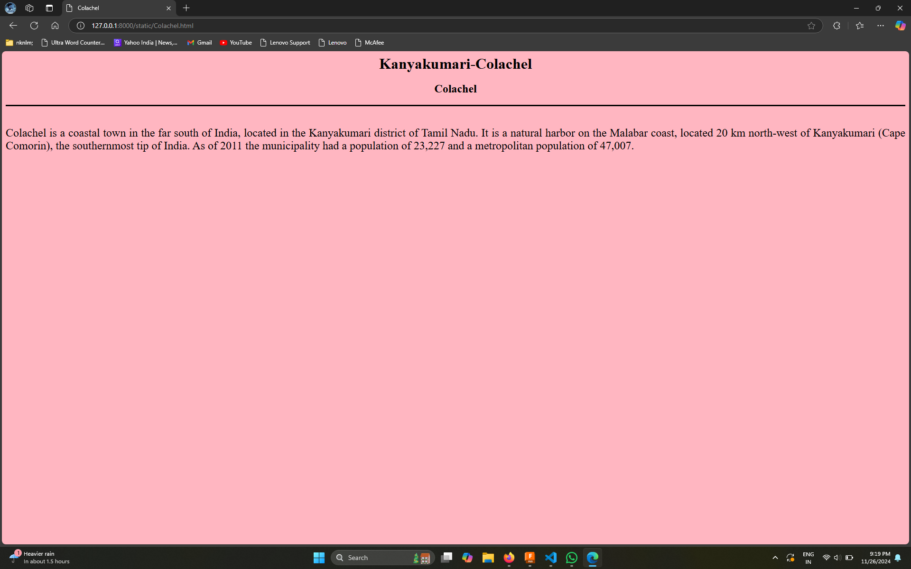
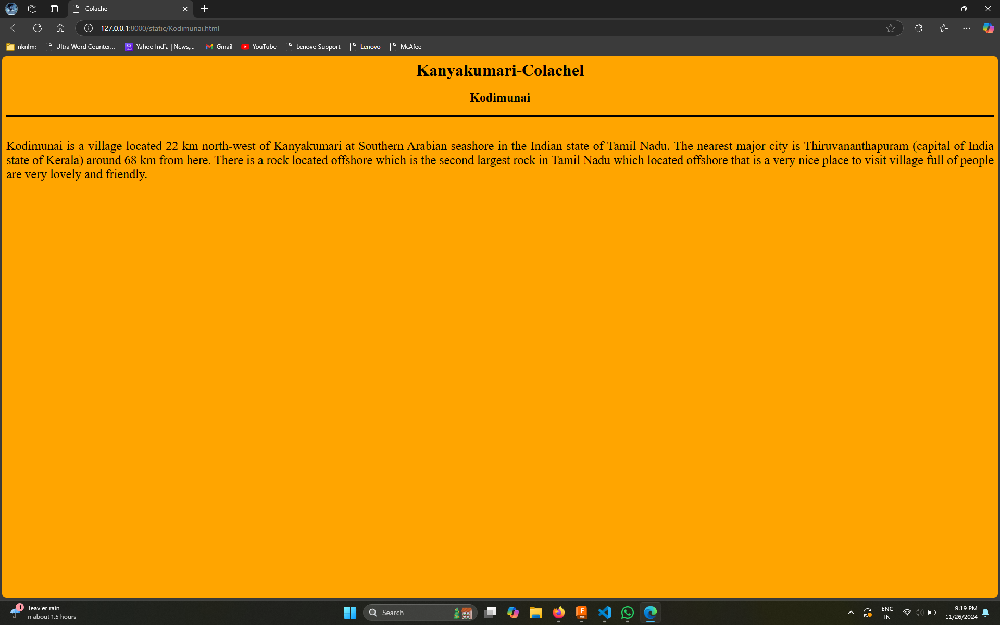
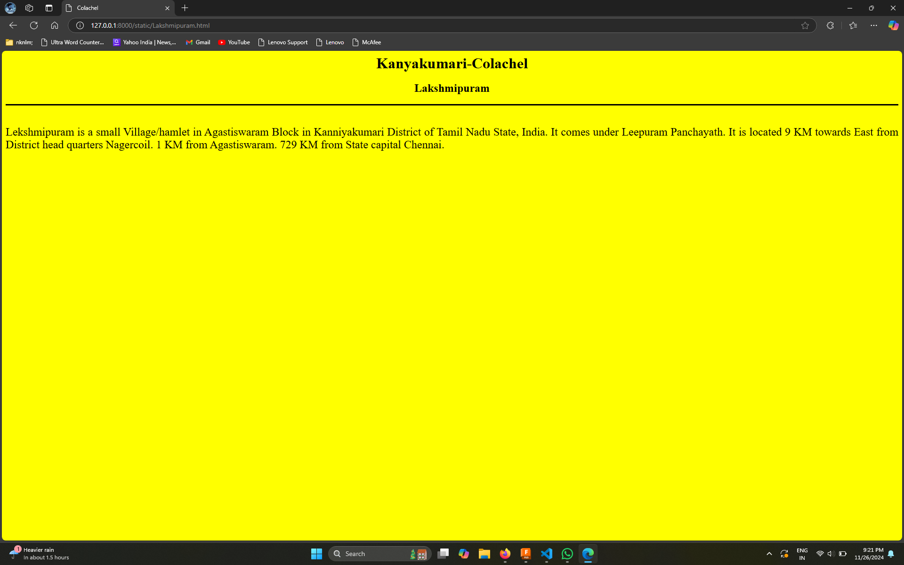
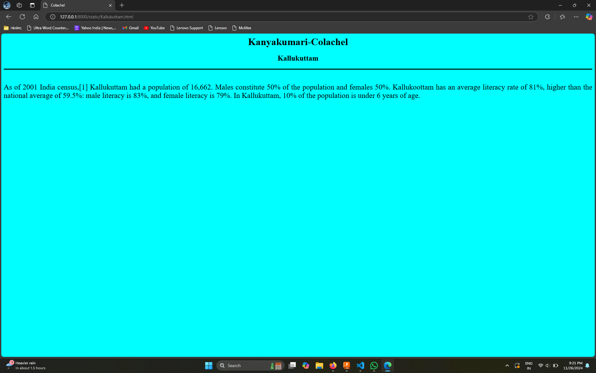
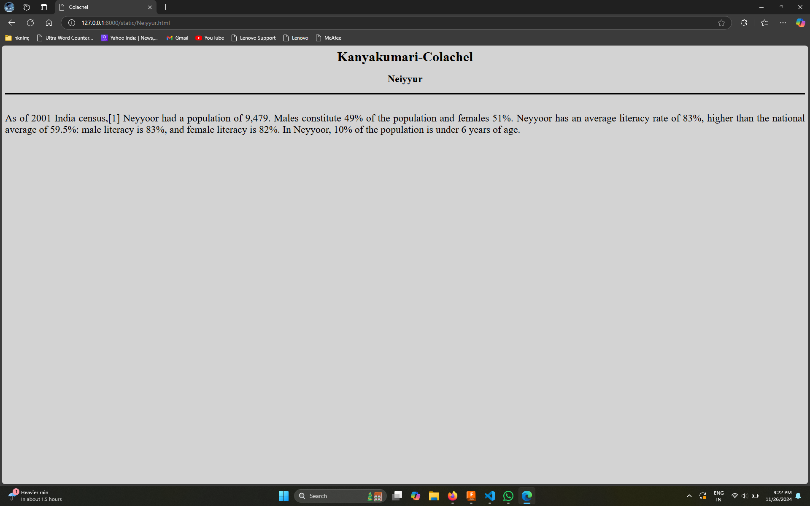

# Ex04 Places Around Me
## Date: 11/26/2024

## AIM
To develop a website to display details about the places around my house.

## DESIGN STEPS

### STEP 1
Create a Django admin interface.

### STEP 2
Download your city map from Google.

### STEP 3
Using ```<map>``` tag name the map.

### STEP 4
Create clickable regions in the image using ```<area>``` tag.

### STEP 5
Write HTML programs for all the regions identified.

### STEP 6
Execute the programs and publish them.

## CODE
'''
map.html 

<html>
<head>
<title>My City</title>
</head>
<body>
    <h1 aligen="center"
<font align="center" color="red"><b>Kanyakumar - Colachel</b></font>
</h1>
<h3 align="center">
    <font color="black"><b>S Star Ashil(24009003)</b></font>
</h3>
<center>

<map name="image-map">
    <area target="" alt="Colachel" title="Colachel" href="Colachel.html" coords="848,683,692,766" shape="rect">
    <area target="" alt="Kodimunai" title="Kodimunai" href="Kodimunai.html" coords="393,784,77" shape="circle">
    <area target="" alt="Lakshmipuram" title="Lakshmipuram" href="Lakshmipuram.html" coords="1627,794,76" shape="circle">
    <area target="" alt="Kallukuttam" title="Kallukuttam" href="Kallukuttam.html" coords="534,276,723,359" shape="rect">
    <area target="" alt="Neiyyur" title="Neiyyur" href="Neiyyur.html" coords="1089,72,66" shape="circle">
</map>
</center>
 </body>
</html>

Colachel.html

<html>
    <head>
        <title>Colachel</title>
    </head>
    <body bgcolor="Lightpink">
        <font><h1 align="center">Kanyakumari-Colachel</h1></font>
        <h2 align="center">Colachel</h2>
        <hr size="3" color="black">
        <font align="center" size="5">
            <br>
            Colachel is a coastal town in the far south of India, located in the Kanyakumari district of Tamil Nadu. It is a natural harbor on the Malabar coast, located 20 km north-west of Kanyakumari (Cape Comorin), the southernmost tip of India. As of 2011 the municipality had a population of 23,227 and a metropolitan population of 47,007. 
        </p></font>
    </body>
</html>

Kodimunai.html

<html>
    <head>
        <title>Colachel</title>
    </head>
    <body bgcolor="orange">
        <font><h1 align="center">Kanyakumari-Colachel</h1></font>
        <h2 align="center">Kodimunai</h2>
        <hr size="3" color="black">
        <font align="center" size="5">
            <br>
            Kodimunai is a village located 22 km north-west of Kanyakumari at Southern Arabian seashore in the Indian state of Tamil Nadu. The nearest major city is Thiruvananthapuram (capital of India state of Kerala) around 68 km from here. There is a rock located offshore which is the second largest rock in Tamil Nadu which located offshore that is a very nice place to visit village full of people are very lovely and friendly.
        </p></font>
    </body>
</html>

Lakshmipuram.html

<html>
    <head>
        <title>Colachel</title>
    </head>
    <body bgcolor="yellow">
        <font><h1 align="center">Kanyakumari-Colachel</h1></font>
        <h2 align="center">Lakshmipuram</h2>
        <hr size="3" color="black">
        <p align="justify">
        <font align="center" size="5">
            <br>
            Lekshmipuram is a small Village/hamlet in Agastiswaram Block in Kanniyakumari District of Tamil Nadu State, India. It comes under Leepuram Panchayath. It is located 9 KM towards East from District head quarters Nagercoil. 1 KM from Agastiswaram. 729 KM from State capital Chennai.
        </p></font>
    </body>
</html>

Kallukuttam.html

<html>
    <head>
        <title>Colachel</title>
    </head>
    <body bgcolor="Cyan">
        <font><h1 align="center">Kanyakumari-Colachel</h1></font>
        <h2 align="center">Kallukuttam</h2>
        <hr size="3" color="black">
        <p align="justify">
        <font align="center" size="5">
            <br>
            As of 2001 India census,[1] Kallukuttam had a population of 16,662. Males constitute 50% of the population and females 50%. Kallukoottam has an average literacy rate of 81%, higher than the national average of 59.5%: male literacy is 83%, and female literacy is 79%. In Kallukuttam, 10% of the population is under 6 years of age.
        </p></font>
    </body>
</html>

Neiyyur.html

<html>
    <head>
        <title>Colachel</title>
    </head>
    <body bgcolor="Lightgrey">
        <font><h1 align="center">Kanyakumari-Colachel</h1></font>
        <h2 align="center">Neiyyur</h2>
        <hr size="3" color="black">
        <p align="justify">
        <font align="center" size="5">
            <br>
            As of 2001 India census,[1] Neyyoor had a population of 9,479. Males constitute 49% of the population and females 51%. Neyyoor has an average literacy rate of 83%, higher than the national average of 59.5%: male literacy is 83%, and female literacy is 82%. In Neyyoor, 10% of the population is under 6 years of age. 
        </p></font>
    </body>
</html>
'''

## OUTPUT









## RESULT
The program for implementing image maps using HTML is executed successfully.
